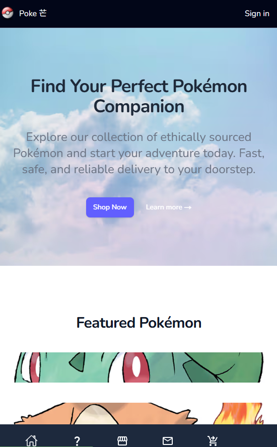

Ecommerce store - Poke 芒

 This is an ecommerce project developed with NEXT.js, a react framework that links frontend and backend all together,  which makes building a website far more easier than before. The ecommerce store is called Poke 芒. The main reason pokemon is chosen as products because all the data are coming from open source API (Application Programming Interface), so it can save time.

 Around 70% of code is written by hand, and the rest is written by AI. The react APIs that are used in this project includes StanStack Query, Redux for remote and global state integration accross different pages.

<ins>Features</ins>

1. __Cart__
 - The reason that redux is found suitable in this project because that are lots of calculation neccessary to make the cart interactive throughout the application, like the quantity, products added to the cart and the billing amount dependent to the user's selections.

 - During development, the difficulty encountered was loading the past user selections from database (Supabase). The data was not synchronized with the frontend application, or if it does, it would clear out all the data in the database, due to the fact that initially, the cart items in the frontend was empty. The solution fixing the problem is to create a state with "useState" function to ensure it would load the data from database first and then do the synchronization with "useEffect".

 - The feature was suggested by the AI (grok), during which i interacted with and in the meanwhile asking AI for help, and fixed the problem until the wee hours.

2. __User Profile__
- The TanStack Query help to handle user request only from the frontend, and give developer access to pending state when the POST request is submitted to the server. It is a convenience way to show a spinner UI and provide a good user experience when waiting for server's response. Users could update their profile on the User Profile page, after that a post request would be handled by useMutation API feature support by TanStack Query which could perform call back actions based on success or error return.

3. __Infinite scrolling__
- The TanStack Query also provides a very handy feature to implement infinite scrolling just like Youtube. Initially, the product page will only show a little amount of products for sale. After the user scrolls nearly at the end of the div (the container), a POST request would be made to the server to load more products for display.

4. __Payment__
- this is the coolest feature because it brings the project to a real world application where user can settle their payment online, but this is the most difficult part because of a lack of teaching courses from Udemy. Hopefully, by reading documentation from Stripe offical website and surfing Youtube for learning materials, the feature is finally finished and able to be launched.

5. __Socket.io__
- this is an another feature implemented to make the application more real-world. Through this chatbox, every user could join together, chating, exploring, and sharing something on the website anonymously, this can not only help the business to collect instanct feedback from their customers, but importantly build up trust, reputation, and their brand in the community. The messages would save into database, if the user is logged in.

- It took me 2 days from plaining to finally implement this features from scratch, thanks to with the help of AI for fast debuging, consulation, guiding along my way. cool!

- The main challenge for the feature is the authentication and authorization part, to gain RLS access to supabase realtime socket. As this project use NextAuth, after considering, insteading of reinvent the Auth system, I decide to circumvent the RLS with JWT built in features supported by NextAuth and use server action to address the security concern, so that i could avoid leaving vulnerability to malicious hackers to initiate their attacks.

6. __User live tracking__
- It is designed to track a number of users currently on our website. When doing business, customer stream could properly bring in oppertunities and customer stream itself, could also attract more visitors to come. Hence, why not make it visible to the ecom store so as to take care of todays business needs? Supabase's realtime feature moves a lot of heavy lifting.

7. __Ai Chat Bot__
- Ai Chat Bot can provide real time values for business throughout the days 24/7. The OpenAi API offers an easy-to-use set-up with input of a command, just in the form of text, then it could generate response satistying your intend like making sales to your clients. This feature is actually really high cost performance, given that some AI providers offers low cost API services like DeepSeek (used in this project) It is pretty easy to set up, the most difficult part is to generate the UI that serves the users, they are pretty much html, css, api call skills and some business logics.

- The chat bot which is feeded with product details, will make a response to the client based on my set-up : `You are a helpful ecommerce store assistant for Poke 芒.
Your goal is to drive sales of the following products: ${JSON.stringify(products?.slice(0, 20) ?? [])}.
If the user query is unrelated to sales, reply in 30 words or fewer.
If it is related to sales, keep the response to 100 words or shorter.` and then, it works! cool

<ins>UI</ins>

Nowadays, AI could really build amazing static pages within a minute with just a few prompts. In this project, the Home page, the About page were actually built with the help of AI. Although it is super easy to simply ask "help me build a home page for my pokemon store", the result is not 100% production ready. The issue that images and UI were broken always happened ,  so tweaking css was needed.

1. __Tailwind CSS__
Tailwind CSS offers css patterns for developer to quickly adopt a common UI. The good thing is that this applies to responsive layout display with mobile first media approach. It is very easy to set mobile UI with just "md:____" and it will make the layout adaptive to mobile screen.

Deployment to Vercel: https://next-pokemon-ecom-demo.vercel.app/
