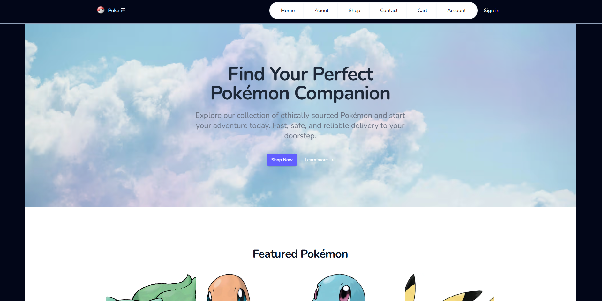

 This is an ecommerce project developed by NEXT.js, a react framework that links frontend and backend all together,  which makes building a website far more easier than before. The ecommerce store is called Poke 芒. The main reason pokemon is chosen as my products is because all the data are coming from open souroce API (Application Programming Interface), so it can save time building my owns products.

 Arround 70% of code is written by hand, and the rest is written by AI, so it might look messy in some parts. The react APIs that are used in this project includes StanStack Query, Redux for remote and global state integration accross different pages.

Features

1. Cart
 The reason that i find redux suitable in this project because that are lots of calculation neccessary to make the cart interactive throughout the application, like the quantity, products added to the cart and the billing amount dependent to the user's selections.

 During development, the difficulty that I encountered was that every time I loaded the cart items from database in order to display the past selections. The data was not sychronized with the frontend application, or if it does, it would clear out all the data in the database, because initially, the cart items in the frontend is empty. The solution that i apply fixs the problem is to create a state with "useState" function to ensure it would load the data from database first and then do the synchronization with "useEffect" function.

 This is the most interesting part, because the feature was suggested by the AI (grok), during which i interacted with and in the meanwhile asking AI for help, and finally fixed the problem ntil the wee hours and all my efforts paid off.

2. User Profile
The TanStack Query help to handle user request only happened in the frontend, and give access to pending state when the POST request is submitted to the server. It make developer capable to deliver the user experience when the user is waiting for server's response.

3. Infinite scrolling
The TanStack Query also provides a very handy feature to adopt infinite scrolling just like scrolling video on Youtube. Initially, the product page will only show a little amount of products for sale. After the user scrolls nearly at the end of the div (the container), a POST request would be made to the server to load more products for display.

4. Payment
I find this is the coolest feature because it brings the project to a real world application where user can settle their payment online, but this is the most difficul part because of lack of teaching courses from Udemy. Hopefully, by reading documentation from Stripe offical website and surfing Youtube for learning materials, the feature is finally finished and able to be launched.

UI

Nowsday, AI could really build amazing pages within a minute with just a few prompt, the Home, About are actually build with help of AI. Although it is super easy to simply ask "help me build a home page for my pokemon store", the result is not 100% production ready. The issue that images and UI were broken happened always, but these were the easiest part because it was all about css tweaks.

1. Tailwind CSS
Tailwind CSS offers css patterns for developer to quickly adopt a common UI. The cool thing is that this applies to responsive layout display with mobile first media approach. I figured out it is very easy to set mobile UI with just "md:____" and it will make your layout adaptive to mobile screen.

 

