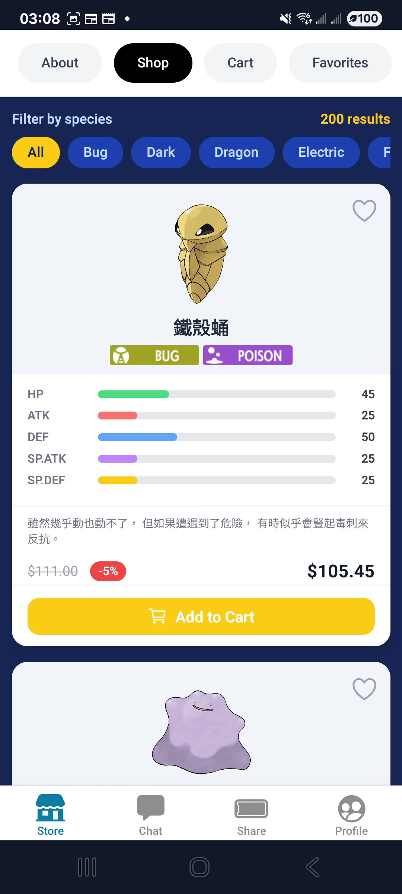
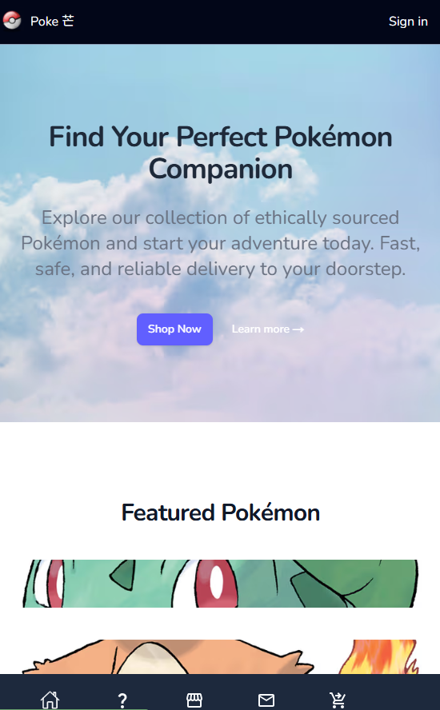
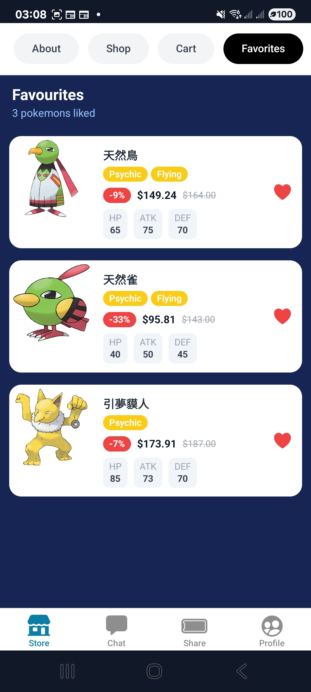
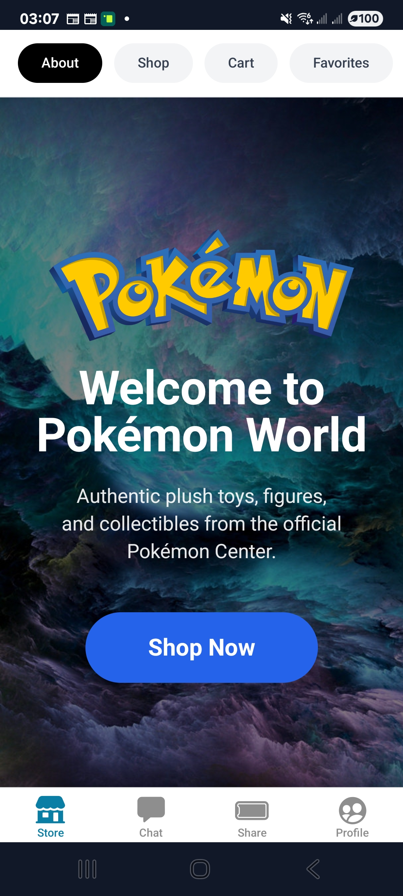
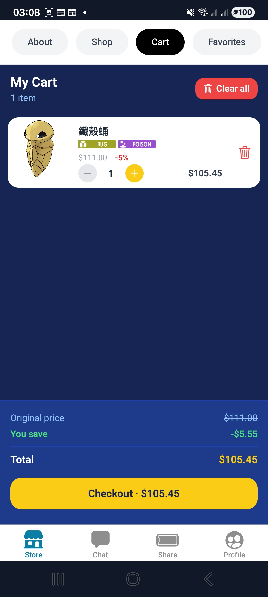

# Poke 芒 – Pokémon E-commerce 🛒🔥

Pokémon-themed online shop with a **web version** (Next.js) and **mobile app** (React Native).
One project, two platforms – built to deliver fun shopping on desktop and on the go!

Live demo (Web): https://next-pokemon-ecom-demo.vercel.app/

## Why This Project?

- Products pulled from free open-source Pokémon APIs – no manual data entry needed.
- ~70% hand-written code + AI help for the rest → fast development!
- Web uses Next.js for full-stack power; mobile uses React Native + Expo for iOS & Android from one codebase.

## Key Tech Stack

| Category       | Web (Next.js)                          | Mobile (React Native)             |
|----------------|----------------------------------------|-----------------------------------|
| Framework      | Next.js                                | React Native + Expo Router        |
| State          | Redux, TanStack Query                  | (Add yours – Redux?)              |
| Backend        | Supabase (DB + realtime)               | Supabase                          |
| Auth           | NextAuth                               | (Expo auth or Supabase)           |
| Payments       | Stripe                                 | (Stripe integration?)             |
| Chat           | Socket.io                              | (Socket.io or similar)            |
| Styling        | Tailwind CSS                           | (NativeWind / Tailwind?)          |
| AI Features    | OpenAI / DeepSeek API (chat bot)       | (Possible chat bot port)          |

## Main Features

| # | Feature              | Description                                                                 | Web Screenshot                  | Mobile Screenshot               |
|---|----------------------|-----------------------------------------------------------------------------|---------------------------------|---------------------------------|
| 1 | Stripe               | Payments    |                                                       | in-progress                          |
| 2 | User Profile         | Update info with TanStack Query mutations & loading states                  |         | in-progress              |
| 3 | Infinite Scrolling   | Lazy-load products like YouTube using TanStack Query                        |             |                |
| 4 | Stripe Payments      | Real online checkout – learned from docs + YouTube                          |          | In progress                 |
| 5 | Live Chat (Socket.io)| Anonymous realtime chat, saved to Supabase if logged in                    |             | In-progress    |
| 6 | Live User Tracking   | Shows online users in realtime via Supabase                                 |        | In-progress           |
| 7 | AI Chat Bot          | 24/7 sales assistant – suggests Pokémon in JSON, remembers preferences     |   | In-progress     |

## Screenshots Overview

### Web Version

<table>
  <tr>
    <td></td>
    <td></td>
    <td></td>
    <td></td>
  </tr>
</table>

### Mobile Version

<table>
  <tr>
    <td></td>
    <td></td>
    <td></td>
    <td></td>
  </tr>
</table>

## UI Inspiration (Modern Clean Vibes)

Here are some sleek e-commerce designs to inspire further improvements for both web and mobile:

<grok-card data-id="706012" data-type="image_card" data-plain-type="render_searched_image"  data-arg-size="LARGE" ></grok-card>

<grok-card data-id="4bf53e" data-type="image_card" data-plain-type="render_searched_image"  data-arg-size="LARGE" ></grok-card>

<grok-card data-id="a6522a" data-type="image_card" data-plain-type="render_searched_image"  data-arg-size="LARGE" ></grok-card>

<grok-card data-id="98326b" data-type="image_card" data-plain-type="render_searched_image"  data-arg-size="LARGE" ></grok-card>

Star ⭐ if you enjoy Pokémon + smart shopping tech!
