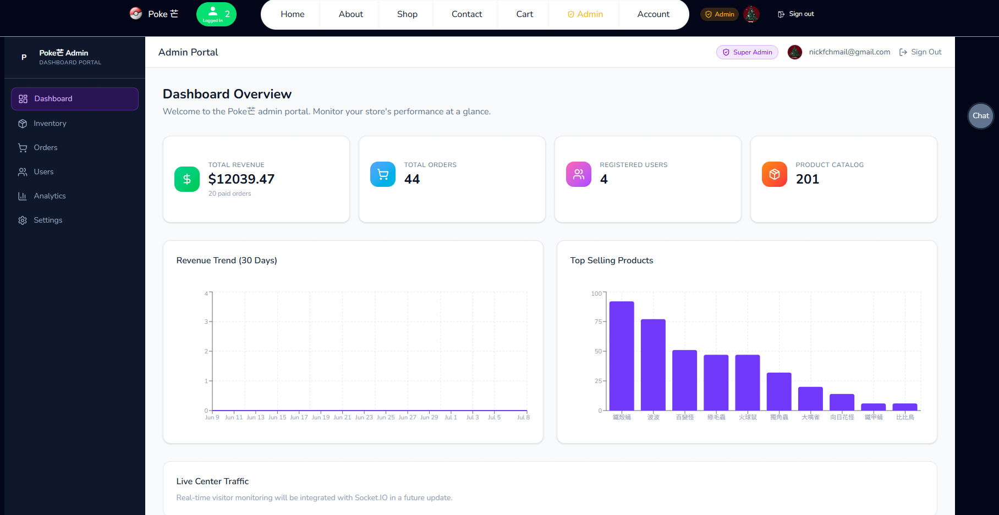
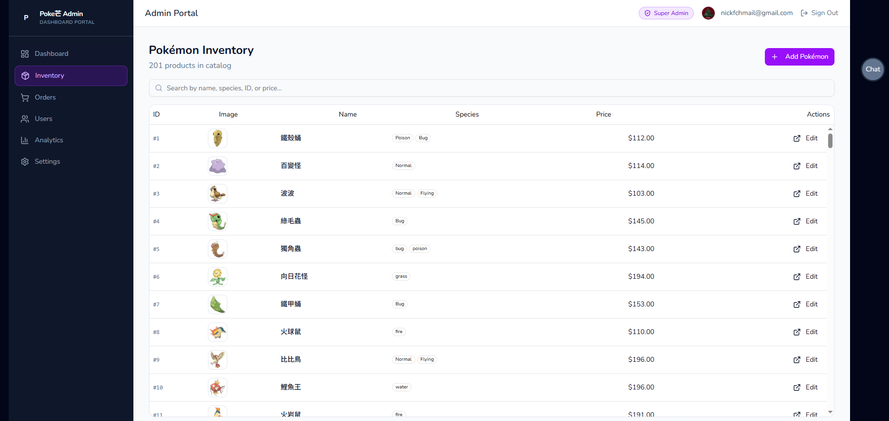
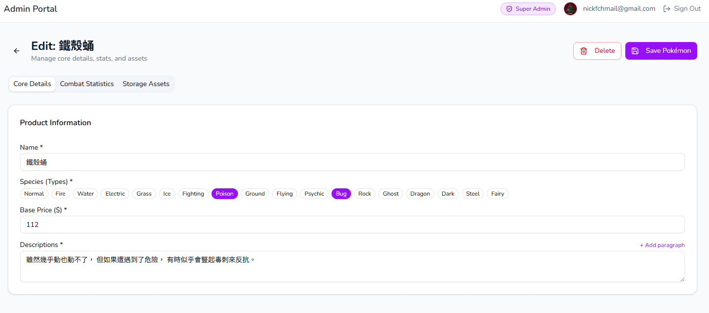

# Poke 芒 – Pokémon E-commerce

  <a href="https://www.youtube.com/watch?v=gqrcgNBPeUU">
    
     
    <strong>Watch the full demo (click to play)</strong>
  </a>

Pokémon-themed online shop with a **web version** (Next.js) and **mobile app** (React Native).
One project, two platforms – built to deliver fun shopping on desktop and on the go!

Live demo (Web): https://next-pokemon-ecom-demo.vercel.app/

> **🤖 Built with DeepSeek V4 Pro** — Approximately 70% hand-written code, with the remaining 30% (including the Admin Portal and AI chat features) developed through prompt-based AI assistance, guided by practical React patterns and real-world e-commerce requirements.

## Why This Project?

- Products pulled from free open-source Pokémon APIs – no manual data entry needed.
- ~70% hand-written code + AI help for the rest → fast development!
- Web uses Next.js for full-stack power; mobile uses React Native + Expo for iOS & Android from one codebase.

## Key Tech Stack

Framework: Next.js
State: Redux, TanStack Query
Backend:Supabase
Auth:NextAuth
Payments:Stripe
Chat: Supabase realtime
Styling:Tailwind CSS
AI Features: DeepSeek API (chat bot)

## Main Features

| # | Feature              | Description                                                                 | Web Screenshot                  |
|---|----------------------|-----------------------------------------------------------------------------|---------------------------------|
| 1 | User Profile         | Update info with TanStack Query mutations & loading states                  |         |
| 2 | Infinite Scrolling   | Lazy-load products like YouTube using TanStack Query                        |             |
| 3 | Stripe Payments      | Real online checkout – learned from docs + YouTube                          |          |
| 4 | Live Chat (Socket.io)| Anonymous realtime chat, saved to Supabase if logged in                    |             |
| 5 | Live User Tracking   | Shows online users in realtime via Supabase                                 |        |
| 6 | AI Chat Bot          | 24/7 sales assistant – suggests Pokémon in JSON, remembers preferences     |   |
| 7 | Admin Portal         | Full RBAC dashboard — manage products, orders, users, analytics            |      |

---

## Admin Portal (New!)

The **Admin Portal** (`/admin`) is a full-featured dashboard built exclusively with **shadcn/ui + Tailwind CSS v4**. It includes:

| Section    | Features                                                                 |
|------------|--------------------------------------------------------------------------|
| **IAM/RBAC** | `members.role` column (`customer` / `admin` / `superadmin`), server-side guards, middleware protection |
| **Dashboard** | KPI cards, 30-day revenue trend chart, top products by sales (live data) |
| **Inventory** | Product table with search, sticky header, inline edit routing            |
| **Product Edit** | Multi-tab form (details, stats with radar chart, image upload to Supabase Storage) |
| **Orders** | Filterable order queue with status badges and detail panel               |
| **Users**  | Registered user list with role indicators                                |
| **Analytics** | Revenue charts + top products from real `order_items` data             |
| **Settings** | Configuration placeholder                                                 |

All admin routes are protected at three layers:
1. **Middleware** (`proxy.js`) — blocks non-admin at the edge
2. **Layout guard** (`admin/layout.js`) — server-rendered redirect
3. **HOC** (`admin-auth.js`) — `withAdminAuth()` wrapper for individual pages

### Admin Portal Screenshots

| Dashboard | Inventory Table | Edit Details |
|-----------|----------------|--------------|
|  |  |  |

---

